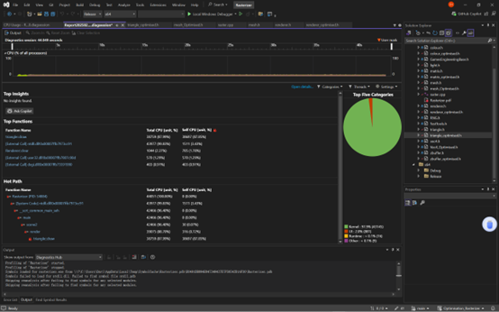
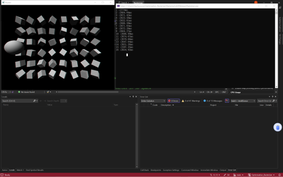

# MultiThread-Rasterizer - 多线程加速的软光栅渲染引擎🚀 
请确保在release模式下运行,基于原始软光栅器进行加速

**C++实现的软件光栅化渲染器 | 基于CPU多线程并行加速 | 完整图形管线实现 | SIMD并行加速**  

## 功能🔥 

### 1. 多线程渲染加速
- **动态任务分配**：将场景网格按线程数分块并分配给工作线程进行并行渲染(Tile-based)

### 2. SIMD加速
- **数据结构优化**: 手写SIMD友好数据结构(如矩阵)以便最大程度利用SIMD进行加速
### 3.管线加速
- **剔除优化**: 应用背面剔除进行优化

### 4.代码加速
- **减少判断**: 尽可能替换代码中的if结构以进行优化
- **内存跳转优化**: 减少代码中的内存跳转,使用空间换取更好性能

## 流程 💻
使用profiler与Chrono锁定性能瓶颈->
优化加速->
对比优化其他部分

## 技术栈 👨‍💻
- C++14
- 库: Cmath, Chrono
- C++多线程
- AVX/SIMD加速
- 图形学
## 加速性能对比 ⚖️
基于场景2的性能对比:  

分析性能瓶颈:

原始速度

SIMD加速后

多线程与背面剔除后

## 结果
在场景1,2,3中对动态场景与多物体场景渲染速度有显著提升,在相同测试环境下 scene2中速度由原始平均2700ms运行效率提升到约700ms,且能保持稳定运行

English:
# MultiThread-Rasterizer - Multithreaded Software Rasterization Rendering Engine 🚀  
*Please run in Release mode. Acceleration based on the original software rasterizer.*

**C++ Implemented Software Rasterizer | CPU Multithreading Parallel Acceleration | Full Graphics Pipeline Implementation | SIMD Parallel Acceleration**  

## Features 🔥

### 1. Multithreaded Rendering Acceleration
- **Dynamic Task Allocation**: Divides scene meshes into thread-based tiles for parallel rendering (Tile-based)

### 2. SIMD Acceleration
- **Data Structure Optimization**: Hand-crafted SIMD-friendly data structures (e.g., matrices) to maximize SIMD utilization

### 3. Pipeline Acceleration
- **Culling Optimization**: Implements backface culling for performance enhancement

### 4. Code-Level Acceleration
- **Reduced Branching**: Minimizes if-statements for optimized control flow
- **Memory Access Optimization**: Reduces memory jumps, trades space for better performance

## Workflow 💻  
Identify performance bottlenecks using profiler & Chrono →  
Optimize acceleration →  
Compare and optimize other components  

## Tech Stack 👨‍💻  
- C++14  
- Libraries: Cmath, Chrono  
- C++ Multithreading  
- AVX/SIMD Acceleration  
- Computer Graphics  

## Performance Comparison ⚖️  
*Based on Scene 2:*  

Performance bottleneck analysis:  
  

Original speed:  
  
After SIMD acceleration:  
  
After multithreading + backface culling:  
  

## Results  
Significant rendering speed improvement in dynamic scenes (Scene 1,2,3) with multiple objects.  
Under identical test conditions in Scene 2:  
- Average execution time reduced from 2700ms to ≈700ms  
- Maintains stable performance during continuous operation  
